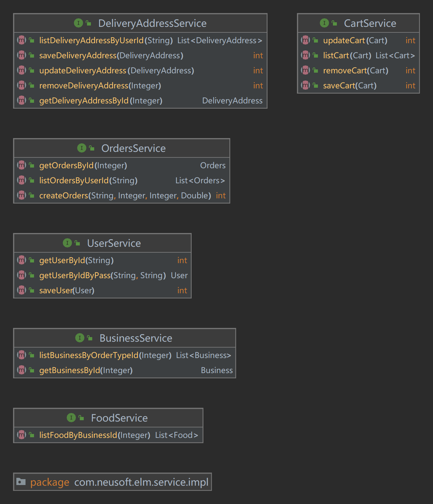

# 饿了么后端项目 —— 实验二和实验三

## 项目需求

本项目参照 “饿了么移动端网页版”制作。本项目专注于完成点餐业务线功能，“饿了么”中的其它功能暂不涉及。

以下内容大致概括了本系统的项目需求：

1. 用户信息管理:在用户进入系统前要求客户进行登录，未注册的用户需要注册后方可登录。登录时需要对用户Id和密码进行校验，正确后即可登录。
2. 商家信息管理：向用户提供商家名称、地址、图片以及食物等相关信息。
3. 购物车及订单管理：允许用户向购物车中添加或删除食物，并生成相关订单。
4. 用户地址管理：一个用户可以拥有多个收货地址并对地址进行修改，保存。

## 业务流程

项目的具体流程如下图所示。


## 项目设计

### 数据库设计

#### DB一览表

| No | 表名称             | 中文名   | 说明                |
|----|-----------------|-------|-------------------|
| 1  | business        | 商家表   | 存储所有商家信息          |
| 2  | food            | 食品表   | 存储每个商家所拥有的所有食品信息  |
| 3  | cart            | 购物车表  | 存储每个用户的购物车中的食品信息  |
| 4  | deliveryaddress | 送货地址表 | 存储每个用户的所有送货地址信息   |
| 5  | orders          | 订单表   | 存储每个用户的所有订单信息     |
| 6  | orderdetailet   | 订单明细表 | 存储每个订单中所订购的所有食品信息 |
| 7  | user            | 用户表   | 存储所有用户信息          |

#### 表结构

约束类型标识：

- PK：primary key 主键
- FK：foreign key 外键
- NN：not null 非空
- UQ：unique 唯一索引
- AI：auto increment 自增长列

#### business（商家表）

| No | 字段名             | 数据类型       | size  | 默认値  | 约束       | 说明                                                                               |
|----|-----------------|------------|-------|------|----------|----------------------------------------------------------------------------------|
| 1  | businessId      | int        |       |      | PK、AI、NN | 商家编号                                                                             |
| 2  | businessName    | varchar    | 40    |      | NN       | 商家名称                                                                             |
| 3  | businessAddress | varchar    | 50    |      |          | 商家地址                                                                             |
| 4  | businessExplain | varchar    | 40    |      |          | 商家介绍                                                                             |
| 5  | businessImg     | mediumtext |       |      | NN       | 商家图片                                                                             |
| 6  | orderTypeId     | int        |       |      | NN       | 点餐分类：         1：美食、2：早餐、3：跑腿代购、4：汉堡披萨、5：甜品饮品、6：速食简餐、7：地方小吃、8：米粉面馆、9：包子粥铺、10：炸鸡炸串 |
| 7  | starPrice       | decimal    | （5,2） | 0.00 |          | 起送费                                                                              |
| 8  | deliveryPrice   | decimal    | （5,2） | 0.00 |          | 配送费                                                                              |
| 9  | remarks         | varchar    | 40    |      |          | 备注                                                                               |

#### food（食品表）

| No | 字段名         | 数据类型       | size  | 默认値 | 约束       | 说明     |
|----|-------------|------------|-------|-----|----------|--------|
| 1  | foodId      | int        |       |     | PK、AI、NN | 食品编号   |
| 2  | foodName    | varchar    | 30    |     | NN       | 食品名称   |
| 3  | foodExplain | varchar    | 30    |     | NN       | 食品名称   |
| 4  | foodImg     | mediumtext |       |     | NN       | 食品图片   |
| 5  | foodPrice   | decimal    | （5,2） |     | NN       | 食品价格   |
| 6  | businessId  | int        |       |     | FK、NN    | 所属商家编号 |
| 7  | remarks     | varchar    | 40    |     |          | 备注     |

#### cart（购物车表）

| No | 字段名        | 数据类型    | size | 默认値 | 约束       | 说明          |
|----|------------|---------|------|-----|----------|-------------|
| 1  | cartId     | int     |      |     | PK、AI、NN | 无意义编号       |
| 2  | foodId     | int     |      |     | FK、NN    | 食品编号        |
| 3  | businessId | int     |      |     | FK、NN    | 所属商家编号      |
| 4  | userId     | varchar | 20   |     | FK、NN    | 所属用户编号      |
| 5  | quantity   | int     |      |     | NN       | 同一类型食品的购买数量 |

#### deliveryaddress（送货地址表）

| No | 字段名         | 数据类型    | size | 默认値 | 约束       | 说明     |
|----|-------------|---------|------|-----|----------|--------|
| 1  | daId        | int     |      |     | PK、AI、NN | 送货地址编号 |
| 2  | contactName | varchar | 20   |     | NN       | 联系人姓名  |
| 3  | contactSex  | int     |      |     | NN       | 联系人性别  |
| 4  | contactTel  | varchar | 20   |     | NN       | 联系人电话  |
| 5  | address     | varchar | 100  |     | NN       | 送货地址   |
| 6  | userId      | varchar | 20   |     | FK、NN    | 所属用户编号 |

#### orders（订单表）

| No | 字段名        | 数据类型    | size  | 默认値  | 约束       | 说明                 |
|----|------------|---------|-------|------|----------|--------------------|
| 1  | orderId    | int     |       |      | PK、AI、NN | 订单编号               |
| 2  | userId     | varchar | 20    |      | FK、NN    | 所属用户编号             |
| 3  | businessId | int     |       |      | FK、NN    | 所属商家编号             |
| 4  | orderDate  | varchar | 20    |      | NN       | 订购日期               |
| 5  | orderTotal | decimal | （7,2） | 0.00 | NN       | 订单总价               |
| 6  | daId       | int     |       |      | FK、NN    | 所属送货地址编号           |
| 7  | orderState | int     |       | 0    | NN       | 订单状态（0：未支付； 1：已支付） |

#### ordedetailet（订单明细表）

| No | 字段名      | 数据类型 | size | 默认値 | 约束       | 说明     |
|----|----------|------|------|-----|----------|--------|
| 1  | odId     | int  |      |     | PK、AI、NN | 订单明细编号 |
| 2  | orderId  | int  |      |     | FK、NN    | 所属订单编号 |
| 3  | foodId   | int  |      |     | FK、NN    | 所属食品编号 |
| 4  | quantity | int  |      |     | NN       | 数量     |

#### user（用户表）

| No | 字段名      | 数据类型       | size | 默认値 | 约束    | 说明               |
|----|----------|------------|------|-----|-------|------------------|
| 1  | userId   | varchar    | 20   |     | PK、NN | 用户编号             |
| 2  | password | varchar    | 20   |     | NN    | 密码               |
| 3  | userName | varchar    | 20   |     | NN    | 用户名称             |
| 4  | userSex  | int        |      | 1   | NN    | 用户性别（1：男； 0：女）   |
| 5  | userImg  | mediumtext |      |     |       | 用户头像             |
| 6  | delTag   | int        |      | 1   | NN    | 删除标记（1：正常； 0：删除） |

### 架构设计

项目采用MVC架构设计如下图所示。


1. 本工程采用：基于Servlet的简易MVC架构。
2. 本工程采用：约定优于配置的原则来搭建简易MVC框架。
3. 本工程中规定：
   请求url与Controller方法映射示例：http://localhost:8080/elm/Controller类名/Controller方法名
4. 本工程中不需要任何配置文件。

### UML图 （有改动，并未更新）

Controller层UML图如下图所示。


Service层UML图如下图所示。



Dao层UML图如下图所示。


### 跨域问题解决方案

本工程使用CORS解决前后端分离开发模式时的跨域问题。 CORS是一个W3C标准，全称是"跨域资源共享"（Cross-origin resource
sharing）。它允许浏览器向跨源服务器，发出XMLHttpRequest请求，从而克服了AJAX只能同源使用的限制。

CORS需要浏览器和服务器同时支持。目前，所有浏览器都支持该功能，IE浏览器不能低于IE10。整个CORS通信过程，都是浏览器自动完成，不需要用户参与。对于开发者来说，CORS通信与同源的AJAX通信没有差别，代码完全一样。浏览器一旦发现AJAX请求跨源，就会自动添加一些附加的头信息，有时还会多出一次附加的请求，但用户不会有感觉。因此，实现CORS通信的关键是服务器。只要服务器实现了CORS接口，就可以跨源通信。

> 附录：CORS过滤器代码：

```java
package com.luxintong.elm.filter;

import java.io.IOException;
import javax.servlet.Filter;
import javax.servlet.FilterChain;
import javax.servlet.FilterConfig;
import javax.servlet.ServletException;
import javax.servlet.ServletRequest;
import javax.servlet.ServletResponse;
import javax.servlet.annotation.WebFilter;
import javax.servlet.http.HttpServletResponse;

@WebFilter("/*")
public class CorsFilter implements Filter {
   @Override
   public void init(FilterConfigfilterConfig) throws ServletException {
   }

   @Override
   public void doFilter(ServletRequest servletRequest, ServletResponse servletResponse, FilterChain filterChain) throws IOException, ServletException {
      HttpServletResponse response = (HttpServletResponse) servletResponse;
      // 注意：这里设置只允许 http://localhost:8081 进行跨域访问
      response.setHeader("Access-Control-Allow-Origin", "http://localhost:8081");
      response.setHeader("Access-Control-Allow-Credentials", "true");
      response.setHeader("Access-Control-Allow-Methods", "POST, GET, OPTIONS, DELETE, PUT");
      response.setHeader("Access-Control-Max-Age", "3628800");
      response.setHeader("Access-Control-Allow-Headers", "x-requested-with,Authorization");
      filterChain.doFilter(servletRequest, servletResponse);
   }

   @Override
   public void destroy() {
   }
}
```

### 事务处理解决方案


首先要明确一点：事务处理放在service层。所以：

1. Connection的创建与销毁要放在service层。
2.为了保证在同一次请求处理的线程中，service层和dao层都共用同一个Connection对象，需要将Connection对象放入ThreadLocal中。service层和dao层使用的Connection对象一律从ThreadLocal获取。
3. dao层不再处理异常，dao层产生的异常将直接抛给service层进行处理。
4. dao层负责关闭PreparedStatement和ResultSet，service层负责关闭Connection。

> 附录：
> ThreadLocal为解决多线程程序的并发问题提供了一种新的思路。当使用ThreadLocal维护变量时，ThreadLocal为每个使用该变量的线程提供独立的变量副本，所以每一个线程都可以独立地改变自己的副本，而不会影响其它线程所对应的副本。
> Synchronized用于线程间的数据共享，而ThreadLocal则用于线程间的数据隔离。

### Servlet返回JSON解决方案

Jackson 是当前用的比较广泛的，用来序列化和反序列化 json 的 Java 的开源框架。Jackson 社区相对比较活跃，更新速度也比较快，从
Github 中的统计来看，Jackson 是最流行的 json 解析器之一。 Spring MVC 的默认 json解析器便是 Jackson。

本项目中，Servlet中使用Jackson将java对象或集合转换为json对象或数组后，返回前端。

```java
ObjectMapper om = new ObjectMapper();
out.print(om.writeValueAsString(result));      // result就是响应数据
```

### 图片解决方案

对于购物系统来说，商家信息、食品信息中必须要使用大量的图片。

在本工程中，由于使用的图片都比较小，所以采用Base64编码方式来存储图片信息。

Base64是一种用64个字符来表示任意二进制数据的方法。我们知道，图片就是二进制数据。而Base64就可以将图片的二进制数据转换成字符串形式。这样能让我们方便的在数据库中，对图片进行存储和读取。

```xml

<img
        src="data:image/jpeg;base64,/9j/4AAQSkZJRgABAQEAYABgAAD/2wBDAAIBAQIBAQICAgICAgICAwUDAwMDAwYEBAMF
BwYHBwcGBwcICQsJCAgKCAcHCg0KCgsMDAwMBwkODw0MDgsMDAz/2wBDAQICAgMDAwYDAwYMCAcIDAwMDAwMDAwMDAwMDAwM
DAwMDAwMDAwMDAwMDAwMDAwMDAwMDAwMDAwMDAwMDAwMDAz/wAARCAA/AD0DASIAAhEBAxEB/8QAHwAAAQUBAQEBAQEAAAAA
AAAAAAECAwQFBgcICQoL/8QAtRAAAgEDAwIEAwUFBAQAAAF9AQIDAAQRBRIhMUEGE1FhByJxFDKBkaEII0KxwRVS0fAkM2Jy
ggkKFhcYGRolJicoKSo0NTY3ODk6Q0RFRkdISUpTVFVWV1hZWmNkZWZnaGlqc3R1dnd4eXqDhIWGh4iJipKTlJWWl5iZmqKj
pKWmp6ipqrKztLW2t7i5usLDxMXGx8jJytLT1NXW19jZ2uHi4+Tl5ufo6erx8vP09fb3+Pn6/8QAHwEAAwEBAQEBAQEBAQAA
AAAAAAECAwQFBgcICQoL/8QAtREAAgECBAQDBAcFBAQAAQJ3AAECAxEEBSExBhJBUQdhcRMiMoEIFEKRobHBCSMzUvAVYnLR
ChYkNOEl8RcYGRomJygpKjU2Nzg5OkNERUZHSElKU1RVVldYWVpjZGVmZ2hpanN0dXZ3eHl6goOEhYaHiImKkpOUlZaXmJma
oqOkpaanqKmqsrO0tba3uLm6wsPExcbHyMnK0tPU1dbX2Nna4uPk5ebn6Onq8vP09fb3+Pn6/9oADAMBAAIRAxEAPwD9/CcC
qHiLW7Pw7od3f6hc29lYWUTz3NzczLDDbxqCzO7kgKoAJJJ4Aq83Svnv/gofoviL4ufs++Jvh94NFzJ4k16yaaRIZDGv2OIr
JJBI/CgXZT7IFJG4TyNgpFJi6cOeai3a5FSfLFySvY7r4X6AviK7Hii/1A65cak0lzpNxJaCEafYzfPHDEpyUO3Z5jcO7Kob
IRQvealpsep2jwzQxTROMPHIoZW9iDxj8K/OL/gnd+3/AKx8G5X+HPxQs9Ut9P0CRrWC/uoH+06EFwEs7iIKXMYPCMBiNcAk
oFZf0U8N+MNM8W6HaanpmoWWoadqEaz2t3azrNb3UbDKvHIp2upBBBBwc11YzBVKEkmtOj6M4MJi6ddN9eqPI9Ctv+GZfjLp
Xh20t7pvAXjJ3hsQ8m6Dw7fKjP5KkkkQzrgJHwqNEQOHAHrHi/wfpfxB8O3mka1p9lqulX0RhubO7hWWG4Q9VdW4I+vcA9q8
0/bvWa1/Zm8QalZgjUNDktdTtHGd0ckFzFICPThSPoa9ctJ1urJJUAAlUN69Rn+tc1V3SqI3opRk6XQ8F/ZQ8Ra34P1O88Ea
qLyTTfDuoXekWt5qGoeZcu0Ijkt0AYb5FltH80bnYp5Mo5G0J9BQvvUnBBzyD2r50+J+vXfh341/EKXS0iF7ovhzT/FUDSIr
L9ot5blJE5Hy+bbjyWYYbYxANfRVucx9QfoMUVV710VhW3DXuPc4X615/wCG9Yt9V+J/iVWSN5YtTj0xZ1TJCx2MNysLH0Bu
JmA9S2Tziu+uH2RE5Ix3rzz4GrY6h4Cstb02Fki8Vn/hIZd5Bbfd4lOT3ADKo64Cj0qYoupKzR51+1n+wjo/7QOqDW9N1M+F
PFaReSmoR2iTQXagghbqIMjTBBvCFZEZDIx3EZU/A+s/FDx5+wd4m046tq2q/Dz+1Lue5sV0y5XUNI1xG+9cPEEeNZGVAzee
iSICvz5OK/W/xFdppumyXE7hLe2QyytwCqgE8Z4//XX57/sOeGvC3xs1LQvENzrWka1Y+LLTdrtlql5DcXEF9HGkzaZHkYaC
MXsKtGpYf6FEMkKS3ZDPKmGh7OUVOPZ/ocM8mhWk6yk4NdUY3xD/AOChPi74tfAfxToE+n+CdZ/tu3SKyubC5lsI4onKE7i0
lx5zYHVdnfIHWvfPAv8AwVW8MHTILXWvCPjDS5oo0RpE+y3FvwAMh/OUnP8Au14b4y+PHw/+IX/BWvwv8Ddd+D2ia5d6hpeq
3/8Aa39kae0GkW1ubqJTMzxNctK72rMDFIiItxbAoS7SDtv+Chvw7/Z6/Yd+A1z8RPF/hmbS9GtrqCweSxtbiYQmfdt/cwlX
b7pGFIwWBbChiMp55l80qdTDuLeuj/zIhluNhLmhWvfujm/in/wUO0DwV4A+Mvii70HV7/WfEHm6dpqRPbpFHp0cRigZnaTg
lpJXZFBJyOOpr9ErCXzoi3HJyMHNfk58Pvh98Ovi98ML3UbbTbJrTxbpmm+JvCjXtoJ7y1jSKw1uZWeRpdkphnCKN2VEbruI
Uu36y2rhw2D0O0+xFGJrUKjUqCaXmduFoVqKcKzu/I5T4267Jo3gSaOKcWkmq3VtpK3Al8prY3U8dv5iHB+dfM3KMcsAKu/D
vwza+DPCemaRYqyWej2kNjArAArHHGEUEDA6KOgArhP2idDg+P2mzfD2CfULdWe31DU76yuEgm0sRTefald2d7ST24XaFICK
7ErmMtzfwr+ON/8ACbxBY+BvidKtrq95M1voesYza67EgChncYWO4yAWVlQEsNo5wJhTvTco79iKlflqpS2PXfih4dPjPwPr
Oko6xS6lp09rG5H3GkUoOe3LDmvzx/Zs/Zwv/F/7NWhnwcLfSdSisYr94tQtXTVLV7xBNJMFaRFTzeEYSGRT9ljUoWiL1+if
jPUVt/BeoTrLjyrWSXd3IVCTj3xnFeH/ABM/ZK1HUbu7vfA93ptlJeahJqN5p2pSTLHNPIT5kkNwvmNbl87mUxSJlRtRGZ5G
rDKEZfvDLHOrKmlRPEdF+EfiDQfElpJqcuieCriZzHqmoWKE3mpqNzA+UlhAspV3LAGaSMFm3q6jY1P44/ATTdP0jWDp2k6j
qXguLTrG1ZdUu74xTurqqxSxsV37CsAiOWKvNcfL84I9a+LHib4mfCrwRrmsTvpt5FojW1u8A1AHMkrxIq72syzf62MknacN
1Jr0bw18JLzwlqVn4r8eeLf7V1DTAbiOIRxWukaY7K0bSLGoEjsEllQPJIVPmbhGrGumoqMVdJO551FYqdRczskeK2Xw31H4
aeA9f0vVdH0+21e98Opd6xcQs9w8cl7epHaW8t0wH2p0YakDIAu1XA2gOu77RtseUMHIIyPpXzjr/iSx+IX7IB8ZWmoS6lB4
0m0nWIZJNo8iOS6tfLgVR0WNML3JIdmJLcfR8X+rFec1Z6H0MXdHH+B/Cx8OaQwlZJtQvJPtV/OinFzcMBucZ5xkYUfwoqKO
Fqz4z+HmmfEfwpd6Lr1jFqekagmye1lU7XX0yOR7EYI7V0NvaG2h45bvjjNNt5p3cq9u8eGxu3qVI9euf0q1Pl+Ew+rp/EfM
/wAXP2TJfhb8GPF8nwr1rxH4duH0m4eLRgx1Gxu5BFIQhinSSReOAI3HOOBxna8NfEL42ro8Us/hXwL4kSeFZ7bUNH1eSK2u
o2XKuBIpYhhzxxjFfQNzbtMuBjH+ff6flXCQ/ASy8PS6xN4cnvfDN7rszXd1c6e6EPcO255vJmWSDzHJO5/L3t3Ynmt4YltW
mkzlng0n7ja9D591m78d/E34beOPDur2fhay8V6x4/tLWKD7TPJpyLbafp90N748wbzBtwBkmRQOTXpkf7O/iT4sQ28nxT8Q
2Ov2VlItwmhaVafZtMknXlXkJ3TSbSThS4XgErkVxnxf/ZK+LPjO21jSbT4najJZa5apdLdf2HpkUltf2skckEkrKFZjJtjX
KJgCDkAEA+weAPhHrs3hiFfFPi7xbq0t3AjT2s72Vk1sxALIJLCKJuDkHbIQcDkinKraC5bbiWGcqjcrs4X9pv4dNqXhT+yf
Btzpdr451iWykisruYi0vo4biNpJp4UJ2qqRu3nRgPuREJfIhk9k+GXxDsvib4Vh1KzjurZj8lxZ3aCO7sZR96GZATskXjIy
QcgglSCYPBHgDT/h9HJpWkaNDp+mLtuFljZWM8zEh3kZiZHlO1S0jks+4ZYkGtXSvC9npeuXeoxWwivL2CC2mkDtiRITIYxt
yQCPMb5gMkEAkhVxx7u56UFZWP/Z">
```

### 接口设计

#### business

1. BusinessController/listBusinessByOrderTypeId
   参数：orderTypeId
   返回值：business数组
   功能：根据点餐分类编号查询所属商家信息
2. BusinessController/getBusinessById
   参数：businessId
   返回值：business对象
   功能：根据商家编号查询商家信息

#### food

1. FoodController/listFoodByBusinessId
   参数：businessId
   返回值：food数组
   功能：根据商家编号查询所属食品信息

#### cart

1. CartController/listCart
   参数：userId、businessId（可选）
   返回值：cart数组（多对一：所属商家信息、所属食品信息）
   功能：根据用户编号查询此用户所有购物车信息
   根据用户编号和商家编号，查询此用户购物车中某个商家的所有购物车信息
2. CartController/saveCart
   参数：userId、businessId、foodId
   返回值：int（影响的行数）
   功能：向购物车表中添加一条记录
3. CartController/updateCart
   参数：userId、businessId、foodId、quantity
   返回值：int（影响的行数）
   功能：根据用户编号、商家编号、食品编号更新数量
4. CartController/removeCart
   参数：userId、businessId、foodId（可选）
   返回值：int（影响的行数）
   功能：根据用户编号、商家编号、食品编号删除购物车表中的一条食品记录
   根据用户编号、商家编号删除购物车表中的多条条记录

#### deliveryAddress

1. DeliveryAddressController/listDeliveryAddressByUserId
   参数：userId
   返回值：deliveryAddress数组
   功能：根据用户编号查询所属送货地址
2. DeliveryAddressController/getDeliveryAddressById
   参数：daId
   返回值：deliveryAddress对象
   功能：根据送货地址编号查询送货地址
3. DeliveryAddressController/saveDeliveryAddress
   参数：contactName、contactSex、contactTel、address、userId
   返回值：int（影响的行数）
   功能：向送货地址表中添加一条记录
4. DeliveryAddressController/updateDeliveryAddress
   参数：daId、contactName、contactSex、contactTel、address、userId
   返回值：int（影响的行数）
   功能：根据送货地址编号更新送货地址信息
5. DeliveryAddressController/removeDeliveryAddress
   参数：daId
   返回值：int（影响的行数）
   功能：根据送货地址编号删除一条记录

#### orders

1. OrdersController/createOrders
   参数：userId、businessId、daId、orderTotal
   返回值：int（订单编号）
   功能：根据用户编号、商家编号、订单总金额、送货地址编号向订单表中添加一条记录，
   并获取自动生成的订单编号，
   然后根据用户编号、商家编号从购物车表中查询所有数据，批量添加到订单明细表中，
   然后根据用户编号、商家编号删除购物车表中的数据。
2. OrdersController/getOrdersById
   参数：orderId
   返回值：orders对象（包括多对一：商家信息；一对多：订单明细信息）
   功能：根据订单编号查询订单信息，包括所属商家信息，和此订单的所有订单明细信息
3. OrdersController/listOrdersByUserId
   参数：userId
   返回值：orders数组（包括多对一：商家信息；一对多：订单明细信息）
   功能：根据用户编号查询此用户的所有订单信息

#### user

1. UserController/getUserByIdByPass
   参数：userId、password
   返回值：user对象
   功能：根据用户编号与密码查询用户信息
2. UserController/getUserById
   参数：userId
   返回值：int（返回行数）
   功能：根据用户编号查询用户表返回的行数
3. UserController/saveUser
   参数：userId、password、userName、userSex
   返回值：int（影响的行数）
   功能：向用户表中添加一条记录

## 项目测试

利用postman对接口进行测试，若能正确返回结果，则表明接口实现正确。如下图所示。


